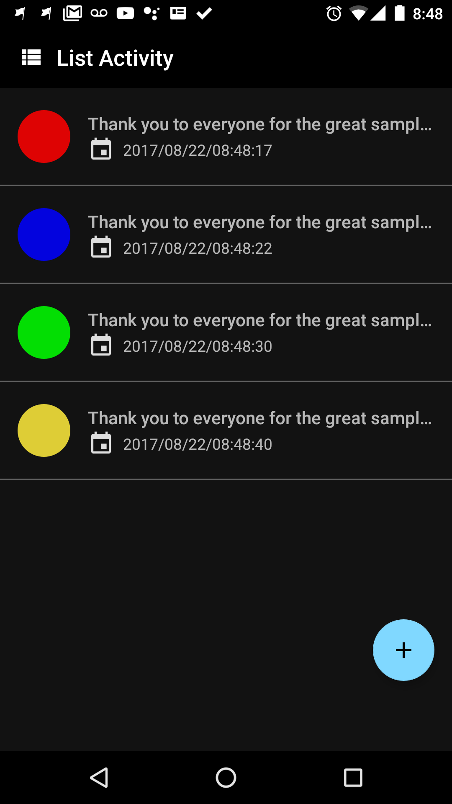
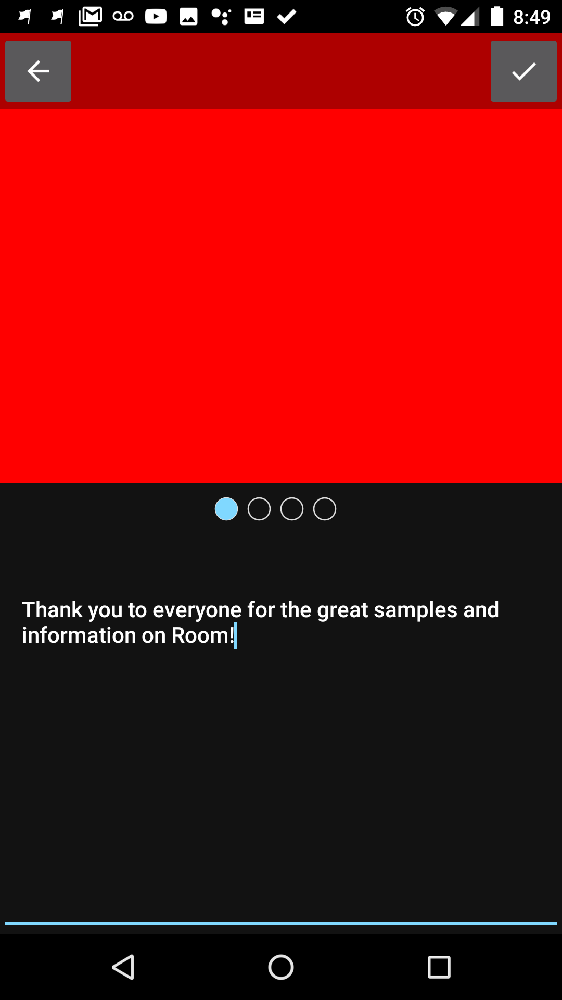
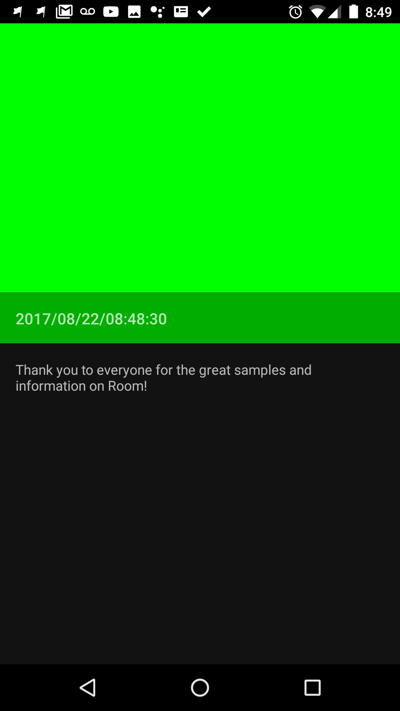
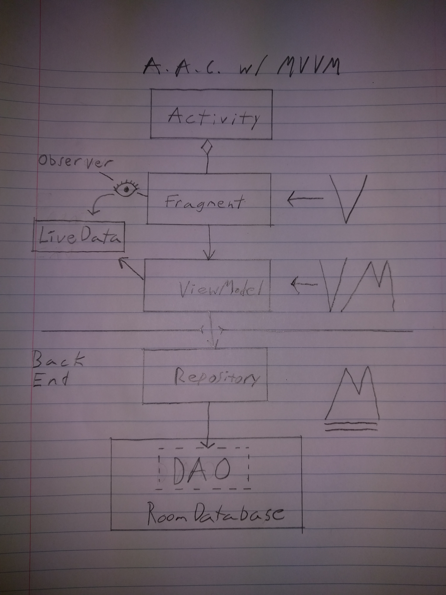

## RecyclerViewTutorial2017
2017 Room Persistence Library Tutorial by Ryan Kay.

**Please Note**
My intention is never to mislead anyone. If something in this tutorial strikes you as inaccurate or simply wrong, please create an issue in this repo. 

**Project Overview**

This project aims to demonstrate the usage of Android Architecture Component's Room Persistence Library; announced at Google I/O 2017. 

Room is an annotation based SQL Database Library. It allows you to fairly easily:
- create a working SQL Database
- create "Entities", or Data Models, which help you convert convert between SQL Data to Java Objects
- interact with the Database via Annotations like @Query().

There's plenty of other features, but in a nutshell, it's basically a way to build and interact with an SQL Database in an easier way than older framework tools. Suffice it to say that one had to write a lot of Boilerplate code, navigate some fairly obscure documentation, and Open/Close many a Cursor and Database Connection in the past.   

 

## Features

### List - Display Data in a RecyclerView, w/ Swipe to Delete

### Create - Create a new Item by selecting a Color, and typing a Message

### Detail - View an Item in Detail

## Model-View-ViewModel Architecture

One of the biggest challenges for this project, was to decouple what M-V-VM actually means, from the various explanations and implementations of it. 

As a very big proponent of MVP for my Front Ends, there were several scenarios I had difficulty understanding through MVVM; particularly in scenarios where having a Controller/Presenter to handle more complex View interactions seems to make more sense. To make matters worse, I saw some people handled such scenarios by creating what is essentially C/P-V-VM-M, and some people chose to turn the VM into more of ViewModelController (which begs the question as to why the f&*% it's called a ViewModel and it also controls the View, indirectly or otherwise). 

After many paragraphs of discussion on the wiseAss Slack channel, I've decided to define the MVVM Architectural Style as follows:

View - Responsible for:
1. Forwards Events to the VM
2. Observes Data exposed by the VM
3. Updates the UI according to such exposed Data
 

ViewModel - Responsible for:
1. Handling events from the View (which usually means asking the Model for Data)
2. Exposes "Observable" data to the View. The fundamental feature of MVVM is that the VM should not have any direct dependencies on Views! In other words, the VM may only communicate back to the V through an Observable-Observer relationship; No direct method calls allowed.
 
Model - Responsible for:
1. Managing Data.
 
**Note:** This part of the App should not have any knowledge of the View, nor should it have direct knowledge of the VMs which use it. 

**Rough Diagram:**

## API Stack:
Although the Primary focus of this project is to demo Android Architecture Components (particularly Room Persistence Library), I've added a few other APIs which I'd be likely to use in such an App. 

Project APIs:
* Room as our Database
* LiveData for exposing/Managing Data Streams
* ViewModel for decoupling VMs from LifeCycle events
* Dagger 2 and ViewModelProvider.Factory for managing Dependency Injection in ViewModels and the Repository.
* ViewPagerIndicator (Jake Wharton)
* CircleImageView (Henning Dodenhof)

**Upcoming Features**
* DataBinding (although MVVM does not 'need' DataBinding, it's certainly worth implementing in many cases)

## Resources and Inspiration

I'm happy to say that my experience learning Room was much more enjoyable than my experience learning to use SQLiteOpenHelper and Cursors. The Codelab for Room was a great intro, and there are also several Open Source Projects which helped me understand how to put everything together. 

Room I/O 2017 Talk:
https://www.youtube.com/watch?v=MfHsPGQ6bgE&t=1418s

Room Codelab:
https://codelabs.developers.google.com/codelabs/android-persistence/#0

Lifecycle (VM + Lifecycle + LiveData) Codelab:
https://codelabs.developers.google.com/codelabs/android-lifecycles/#0

A few AAC Samples (this were super helpful; thank you to these Devs!):
https://github.com/googlesamples/android-architecture-components

## About Me
I'm an Android Dev living in Victoria BC Canada. I'm a major Nerd, and rambling about Software is quite therapeutic for me, to the extent that I have a [Youtube Channel](https://www.youtube.com/user/gosuddr93) mostly dedicated to that. I also do a Weekly Live Android Developer Q&A Series most Sundays at 9:00AM PDT (GMT -7). You can watch that at the aforementioned time [here](https://www.youtube.com/c/wiseAss/live).

**Please Read**
I don't release this stuff for free because I don't like money. Actually, I could use all the help I can get to improve my Equipment, Production Quality, Content, and pay my living expenses. If my content is worth even the average fancy Hipster Coffee to you, then please Consider sending me a Fiver once on Patreon. 

## Social Media

Facebook: https://www.facebook.com/wiseassblog/

G+: https://plus.google.com/+wiseass

Twitter: https://twitter.com/wiseass301

Patreon: https://www.patreon.com/bePatron?u=5114325

Blog: http://wiseassblog.com/
